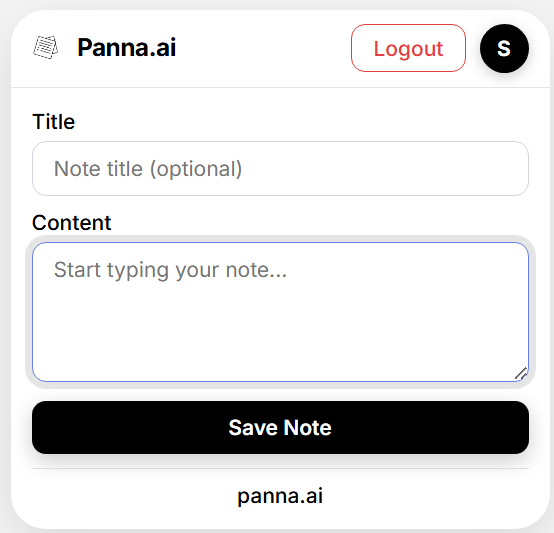

# Panna.ai – AI-Powered Note Taking App


A modern, full-stack note-taking application with AI capabilities, real-time synchronization, browser extension, and a beautiful user interface built with Next.js, Supabase, and Google Gemini AI.

---

## 🚀 Live Demo

### Landing Page


### Dashboard Interface
Experience a clean, modern three-panel layout with:
- **Sidebar**: Quick access to all notes, favorites, and categories
- **Notes List**: Browse and search through your notes with timestamps
- **Editor**: Rich text editor with AI tools, tags, and image support


### Browser Extension
Capture notes from any website with our powerful Chrome extension:



---

## 🔧 Browser Extension Setup

### Installation
1. **Download the extension** from the `extension/` folder
2. **Open Chrome** and go to `chrome://extensions/`
3. **Enable Developer mode** (toggle in top-right corner)
4. **Click "Load unpacked"** and select the extension folder
5. **Pin the extension** to your toolbar for easy access

### Features
- **Automatic Session Sync**: Sign in once on the main website, and the extension automatically recognizes your session
- **Google OAuth**: Sign in with Google directly in the extension popup
- **Quick Capture**: Double-click any selected text to save it instantly
- **Real-time Updates**: Notes appear immediately on your dashboard
- **Clean UI**: Matches your main application's design perfectly

---

## ✨ Features

### 📝 Rich-Text Markdown Editor

- Full toolbar with formatting buttons (Bold, Italic, Underline, Strikethrough, Code, Links)
- Live preview mode
- Keyboard shortcuts (Ctrl+B, Ctrl+I, Ctrl+S, Ctrl+1-3 for headings, etc.)
- Support for headings, lists, tables, images, links, quotes, task lists
- Responsive design for all devices
- Syntax highlighting and markdown rendering with GFM support

### 📁 Categories & Organization

- Create, edit, and delete categories with real-time updates
- Drag and drop support for notes and categories
- Instant search and filtering within categories
- Nested organization with visual hierarchy

### ⭐ Favorites & Trash System

- Star/unstar notes with visual indicators
- Soft delete to trash with restore functionality
- Permanent delete option from trash

### 🌐 Browser Extension

- **Quick Capture**: Double-click any selected text on any website to instantly save it to your notes
- **Universal Compatibility**: Works on all websites - news articles, research papers, social media, and more
- **Real-time Sync**: Notes appear instantly on your dashboard with automatic source attribution
- **Clean Interface**: Minimalist popup design matching your main application
- **Seamless Authentication**: 
  - **Automatic Session Sync**: If you're signed in on the main website, the extension automatically detects and syncs your session
  - **Google OAuth Integration**: Sign in with Google directly in the extension popup
  - **Session Persistence**: Stay signed in across browser sessions
  - **Cross-Platform**: Works seamlessly between web app and extension
- **Smart Context Menu**: Right-click on any webpage to access quick note capture
- **Custom Logout Dialog**: Clean, in-extension logout confirmation (no browser popups)

### 🎨 Responsive Design

- Mobile-first approach with adaptive layouts
- Touch-friendly interface and scalable elements

### 🔄 Real-Time Collaboration

- Real-time note updates across tabs and devices using Supabase Realtime
- Auto-save with visual indicators
- Online/offline status detection
- Collaboration presence tracking and conflict resolution

### 👥 Multi-User Collaboration

- Share notes with read/write permissions
- Real-time collaboration panel and user presence indicators
- Invite system with role management

### 🤖 AI Integration (Google Gemini)

- AI Summarize, Rephrase, Translate, Smart Tags, Template Generation, Related Notes
- All AI interactions saved to database for analytics

### 🌙 Theme & Customization

- Light/Dark mode with system theme detection
- Persistent user preferences and custom theme colors
- Font size and editor theme options

### ⌨️ Keyboard Shortcuts

- Comprehensive shortcuts for formatting, structure, actions, and lists

### 💾 Data Persistence & Security

- Supabase integration with PostgreSQL and RLS
- Full-text search, data backup, and sync

### 🔍 Advanced Search & Discovery

- Full-text search, tag/category filtering, advanced operators, and search history

### 🔐 Authentication & Security

- **Complete Authentication System**: Supabase Auth with email/password and Google OAuth
- **Password Management**: Reset, update, and secure password handling
- **User Profile Management**: Avatar uploads, preferences, and profile settings
- **Secure Endpoints**: Protected API routes with JWT validation
- **Cross-Platform Sessions**: Seamless authentication between web app and browser extension
- **Service Role Integration**: Secure server-side operations with admin privileges
- **Session Persistence**: Automatic session refresh and cross-device synchronization

---

## 🛠️ Tech Stack

- **Frontend:** Next.js 14, React 18, TypeScript, Tailwind CSS
- **Backend:** Supabase (PostgreSQL, Auth, Realtime, Storage)
- **AI:** Google Gemini AI (`@google/generative-ai`)
- **State Management:** Zustand with persistence
- **Forms:** React Hook Form + Zod
- **UI:** shadcn/ui, Radix UI
- **Markdown:** React Markdown + remark-gfm
- **Browser Extension:** Chrome Extension API, Content Scripts, Background Scripts
- **Authentication:** Supabase Auth with Google OAuth integration
- **API Endpoints:** 
  - `/api/notes/create` - Create notes from extension
  - `/api/auth/check-session` - Session validation for extension
  - `/api/extension/notes/create` - Dedicated extension note creation
  - `/api/extension/validate` - Extension authentication validation
- **Real-time:** Supabase Realtime subscriptions for live updates
- **Testing:** Jest, React Testing Library, Playwright

---

## 🌐 Browser Extension Development

### Extension Architecture
- **Manifest V3**: Modern Chrome extension with service worker
- **Content Scripts**: Inject functionality into web pages for text selection
- **Background Scripts**: Handle context menu and notification APIs
- **Popup Interface**: Clean, responsive UI matching the main application
- **Chrome Storage**: Secure local storage for session management

### Key Features Implemented
- **Automatic Session Sync**: Detects existing sessions from main website
- **Google OAuth Flow**: Seamless authentication within extension popup
- **Real-time Note Creation**: Instant synchronization with dashboard
- **Context Menu Integration**: Right-click to save selected text
- **Cross-Origin Communication**: Secure API calls to main application
- **Error Handling**: Comprehensive error management and user feedback

### Extension Files
```
extension/
├── manifest.json          # Extension configuration
├── popup.html            # Extension popup interface
├── popup.js              # Main extension logic
├── background.js         # Background service worker
├── content-script.js     # Web page injection script
├── supabase-client.js    # Supabase client for extension
└── icons/                # Extension icons
```

---

## 📦 Getting Started

### Prerequisites

- Node.js 18+
- npm or yarn
- Supabase account
- Google Gemini API key

### Installation

```bash
git clone https://github.com/mdtaufique-alam/panna-ai.git
cd panna-ai
npm install
cp .env.example .env.local
# Fill in your environment variables in .env.local
npm run dev
```

Open [http://localhost:3000](http://localhost:3000) in your browser.

### Environment Variables

Create a `.env.local` file in the root directory:

```env
# Supabase Configuration
NEXT_PUBLIC_SUPABASE_URL=your_supabase_project_url
NEXT_PUBLIC_SUPABASE_ANON_KEY=your_supabase_anon_key
SUPABASE_SERVICE_ROLE_KEY=your_supabase_service_role_key

# Gemini AI Configuration
GEMINI_API_KEY=your_gemini_api_key

# App Configuration
NEXT_PUBLIC_APP_URL=http://localhost:3000
```

**Important Notes:**
- **Service Role Key**: Required for extension note creation and admin operations
- **Google OAuth**: Configure Google OAuth in Supabase dashboard for extension authentication
- **CORS Settings**: Ensure localhost:3000 is allowed in Supabase CORS settings

---

## 📁 Project Structure

<details>
<summary>Click to expand</summary>

```
panna-ai/
├── app/                        # Next.js app directory
│   ├── auth/                  # Authentication pages
│   ├── dashboard/             # Main application
│   ├── settings/              # Settings page
│   ├── api/                   # API routes
│   │   ├── auth/             # Authentication endpoints
│   │   ├── user/             # User management endpoints
│   │   └── ai/               # AI integration endpoints
│   ├── layout.tsx            # Root layout
│   └── page.tsx              # Home page
├── components/                # React components
│   ├── auth/                 # Authentication components
│   ├── ui/                   # shadcn/ui components
│   ├── rich-text-editor.tsx  # Advanced markdown editor
│   ├── note-editor.tsx       # Main note editing interface
│   ├── notes-list.tsx        # Notes list with drag & drop
│   ├── collaboration-panel.tsx # Real-time collaboration
│   └── related-notes.tsx     # AI-powered note suggestions
├── hooks/                     # Custom React hooks
│   ├── use-notes-store.ts    # Notes state management
│   ├── use-ai.ts             # AI integration hook
│   ├── use-realtime.ts       # Real-time features
│   └── use-toast.ts          # Toast notifications
├── lib/                       # Utility functions
│   ├── supabase/             # Supabase client configuration
│   ├── gemini.ts             # Google Gemini AI integration
│   └── utils.ts              # General utilities
├── scripts/                   # Database scripts
│   ├── create-tables.sql     # Database schema
│   └── seed-data.sql         # Sample data
└── types/                     # TypeScript type definitions
```

</details>

---

## 🗄️ Database Schema

- **notes:** Full-text search, tags, soft delete, collaboration
- **categories:** Hierarchical, user-scoped, RLS
- **ai_interactions:** Track AI usage, analytics, cost
- **note_collaborators:** Multi-user, role-based, invitations

---

## 🤖 AI Integration

- Uses official `@google/generative-ai` npm package
- Summarization, style transformation, translation, smart tags, templates, related notes
- All interactions logged for analytics and cost tracking

---

## 📱 Responsive Design

- Mobile: Single column, collapsible sidebar, touch-optimized
- Tablet: Two-column, hybrid support
- Desktop: Three-column, full feature set

---

## 🚀 Deployment

### Deploy to Vercel

1. Push your code to GitHub
2. Connect repository to Vercel
3. Add environment variables in Vercel dashboard
4. Deploy!

### Production Environment Variables

```env
NEXT_PUBLIC_SUPABASE_URL=your_production_supabase_url
NEXT_PUBLIC_SUPABASE_ANON_KEY=your_production_supabase_anon_key
SUPABASE_SERVICE_ROLE_KEY=your_production_supabase_service_role_key
GEMINI_API_KEY=your_gemini_api_key
NEXT_PUBLIC_APP_URL=https://your-domain.com
```

---

## 🆕 Recent Updates

### Version 2.0 - Browser Extension & Enhanced Authentication
- ✅ **Browser Extension**: Full-featured Chrome extension with automatic session sync
- ✅ **Google OAuth Integration**: Seamless sign-in with Google accounts
- ✅ **Cross-Platform Authentication**: Session sharing between web app and extension
- ✅ **Real-time Note Sync**: Instant synchronization between extension and dashboard
- ✅ **Service Role Integration**: Secure server-side operations for extension
- ✅ **Enhanced UI/UX**: Improved authentication flows and user experience
- ✅ **Comprehensive Error Handling**: Better error management and user feedback

### Key Technical Improvements
- **Session Management**: Automatic session detection and synchronization
- **API Architecture**: Dedicated endpoints for extension functionality
- **Security**: Enhanced authentication with JWT validation and service role keys
- **Performance**: Optimized real-time updates and state management
- **User Experience**: Seamless cross-platform experience

---

## 👨‍💻 About the Developer

This project is developed by **Hasnain** as a modern, AI-powered note-taking solution. Built with love and attention to detail, Panna.ai combines the best of modern web technologies with intelligent AI features to create a seamless note-taking experience.

### Key Highlights:
- 🎨 **Beautiful UI/UX**: Clean, minimalist design with dark/light theme support
- 🤖 **AI-Powered**: Smart features powered by Google Gemini AI
- 🔄 **Real-time Sync**: Instant synchronization across devices
- 🔒 **Privacy-First**: Your notes are secure and private
- 💰 **Free Forever**: No subscriptions, no hidden costs

---

## 🤝 Contributing

We welcome contributions! Please see [CONTRIBUTING.md](CONTRIBUTING.md) for guidelines.

---

## 📞 Support

- Check the documentation above
- Review code comments for implementation details
- All features are tested and working as expected
- For issues or questions, please open an issue on GitHub

**Happy note-taking with Panna.ai! 📝✨**
